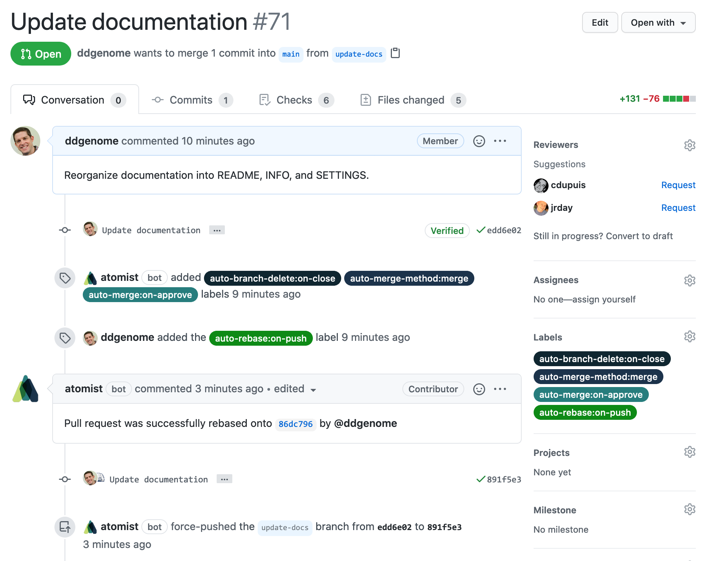
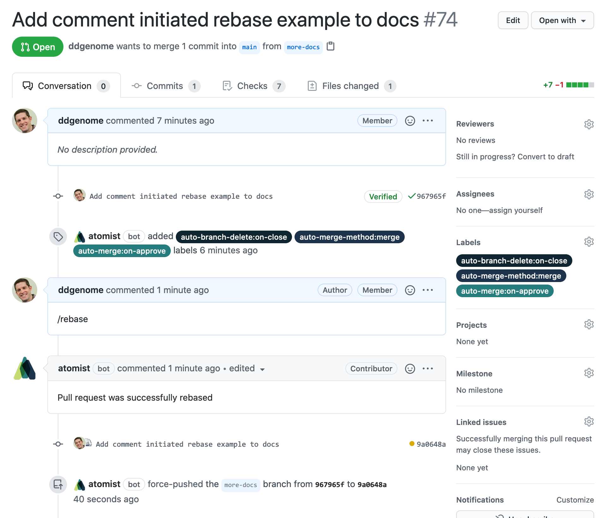

Keep pull request branches up-to-date with the base branch so conflicts are
found early and you can avoid surprises when you try to merge. Stop juggling
multiple feature branches, manually rebasing as other pull requests are merged
or other commits are pushed to the default branch. You don't have to think about
your pull request branches any more&mdash;this skill keeps them in harmony with
the base branch.

-   Automatically rebase pull request branches when there are new commits pushed
    to base branch
-   Choose your preferred merge strategy
-   Select which pull requests get automatically rebased using the
    auto-rebase:on-push
    label
-   Initiate a rebase of any pull request at any time by adding the comment
    `/rebase` to it
-   Automatically close pull requests if there are no differences between base
    and pull request branch after rebase

For example, if open pull request branch `feature-x` has base branch `main`, and
someone pushes new commits to `main`, then `feature-x` will be rebased onto the
new commits to `main`.

This skill will add the labels it uses to manage rebase configuration to each
repository it is enabled on.

### Rebase pull request branch when new commits are pushed to base branch

### Initiate rebase with pull request comment

