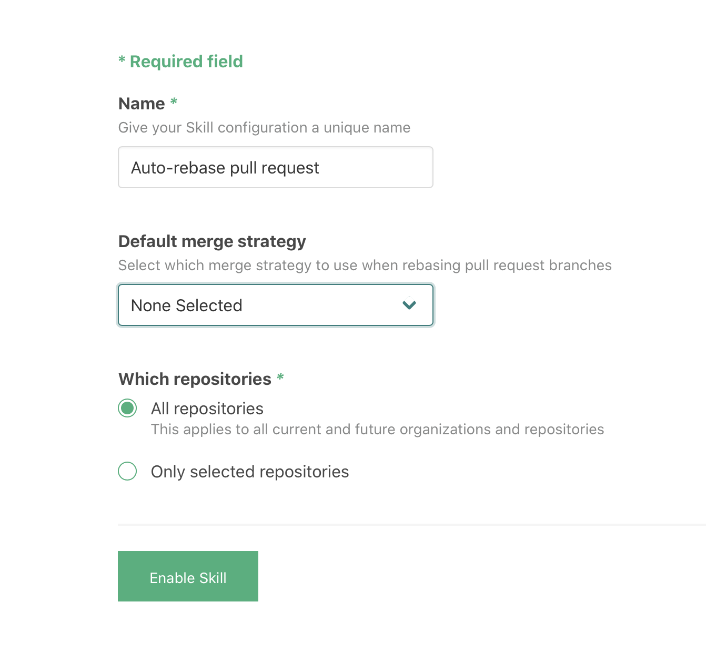

# `atomist/github-auto-rebase-skill`

Automatically rebase pull request branches when pushes to the base branch occur. 

<!---atomist-skill-readme:start--->

# What it's useful for

With this skill you can automatically rebase pull request branches when pushes to base branch happen. 

For example, if open pull request branch `v2` has base branch `master`, and someone pushes a change to `master`, then
`v2` will be rebased with the new commit(s) to `master`.

This approach makes it easy for pull request authors (or anyone with permissions in the repository) to flag a pull 
request for auto-rebase, simply by adding the `auto-rebase:on-push` label. 

# Before you get started

Connect and configure these integrations:

1. **GitHub**
2. **Slack**

The **GitHub** integration must be configured in order to use this skill. At least one repository must be selected. We recommend connecting the
**Slack** integration.

# How to configure

1. **Select the merge strategy**
    
    The selected merge strategy will be used for the rebase.
    
    
    
    You can select one of the options:

    - **Ours** — This option forces conflicting hunks to be auto-resolved cleanly by favoring 'our' version. Changes 
        from the other tree that do not conflict with our side are reflected in the merge result.
    - **Theirs** — This is the opposite of **Ours**.
    
    Review the [git documentation](https://git-scm.com/docs/merge-strategies) for details on these options.

2. **Determine repository scope**

    

    By default, this skill will be enabled for all repositories in all organizations you have connected.

    To restrict the organizations or specific repositories on which the skill will run, you can explicitly choose 
    organization(s) and repositories.

# How to use Pull Request auto-rebase

1. **Configure the skill, set default auto-rebase strategy** 

    

2. **For every new pull request raised, manually add the `auto-rebase:on-push` label to enable auto-rebase**

3. **Enjoy not having to manually rebase your pull request!**

To create feature requests or bug reports, create an [issue in the repository for this skill](https://github.com/atomist-skills/github-auto-rebase-skill/issues). See the [code](https://github.com/atomist-skills/github-auto-rebase-skill) for the skill.

<!---atomist-skill-readme:end--->

---
 
Created by [Atomist][atomist].
Need Help?  [Join our Slack workspace][slack].

[atomist]: https://atomist.com/ (Atomist - How Teams Deliver Software)
[slack]: https://join.atomist.com/ (Atomist Community Slack)
