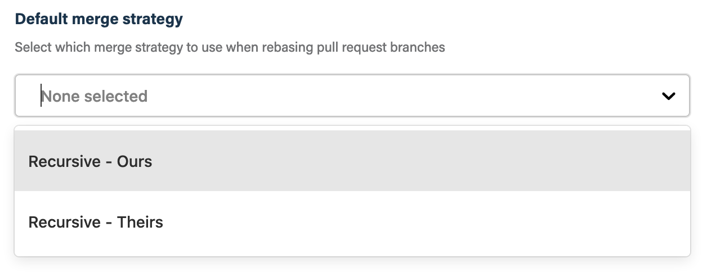

## Before you get started

Connect and configure these integrations:

1.  [**GitHub**](https://go.atomist.com/catalog/integration/github "GitHub Integration")
    _(required)_

## How to configure

1.  **Select the merge strategy**

    The selected merge strategy will be used for the rebase.

    

    You can select one of the options:

    -   **Recursive - Ours** — This option forces conflicting hunks to be
        auto-resolved cleanly by favoring 'our' version. Changes from the other
        tree that do not conflict with our side are reflected in the merge
        result.
    -   **Recursive - Theirs** — This is the opposite of **Ours**.

    Review the [git documentation](https://git-scm.com/docs/merge-strategies)
    for details on these options.

1.  **Determine repository scope**

    

    By default, this skill will be enabled for all repositories in all
    organizations you have connected.

    To restrict the organizations or specific repositories on which the skill
    will run, you can explicitly choose organizations and repositories.

1.  **Activate the skill**

    Save your configuration and activate the skill by clicking the "Enable
    skill" button.
